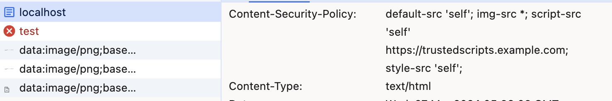

在HTML的<meta>标签中设置Content-Security-Policy（内容安全策略）作为http-equiv的值，这实际上是一种在页面级别应用内容安全策略的方法。这样做可以让你定义哪些类型的资源（如脚本、图片、CSS文件等）可以被加载，以及它们可以从哪里加载。这是提高网站安全性的一个重要手段，可以帮助防止跨站脚本（XSS）攻击和其他安全威胁。

通过<meta>标签设置CSP不会改变服务器的HTTP响应头部，但会让浏览器在处理页面时应用CSP规则。这是一种在客户端实施安全策略的方式，尤其适用于无法直接控制服务器响应头的情况。然而，通过HTTP响应头直接设置CSP通常被认为是更优的做法，因为它可以覆盖更广泛的场景，并且有些CSP功能（如违规报告）只能通过HTTP响应头来实现。

```sh
      add_header Content-Security-Policy "default-src 'self'; img-src *; script-src 'self' https://trustedscripts.example1.com; style-src 'self';";
```

```sh
 # 静态文件服务
        location / {
            root /usr/share/nginx/html;
            index index.html index.htm;
            add_header Content-Security-Policy "default-src 'self'; img-src *; script-src 'self' https://trustedscripts.example.com; style-src 'self';";
       }
```

 

<!-- more -->


